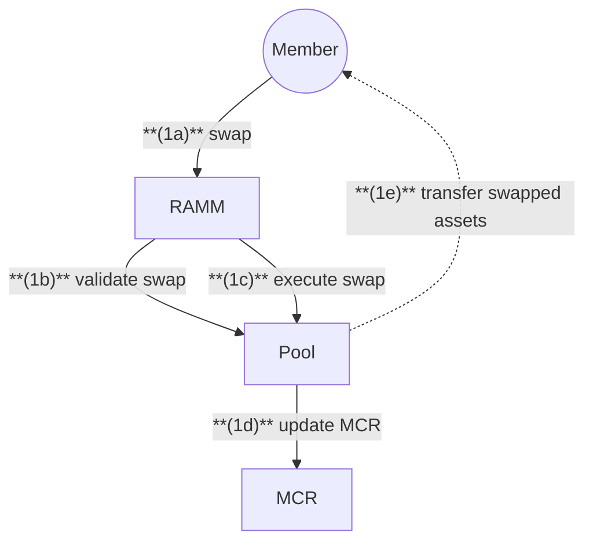
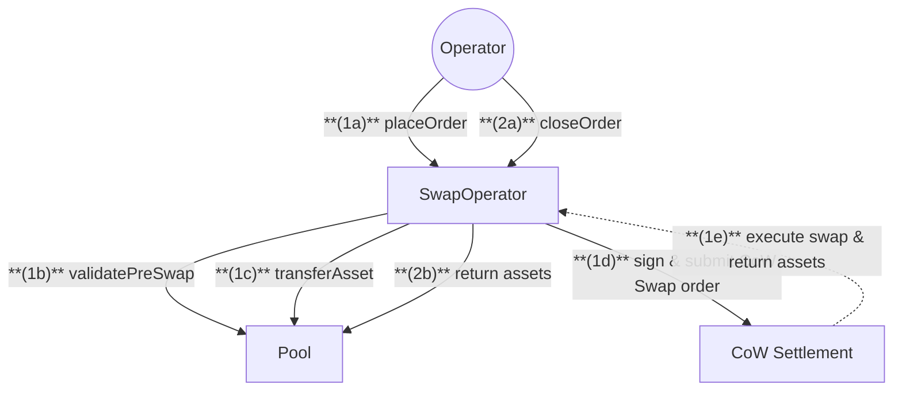

# Capital Contracts

## Member Flow

## Operator Flow

## Actions

### Quick Summary:

1. Members can swap NXM/ETH through RAMM
2. Operators manage large swaps through CoW Protocol
3. Circuit breakers protect capital adequacy

### 1. Member Actions

1. **Swap NXM/ETH**
   - **(1a)** `Member` calls `swap` on RAMM
   - **(1b)** `RAMM` validates swap conditions:
     - System not paused
     - Swap not paused
     - Valid deadline
   - **(1c)** `RAMM` executes swap with Pool
   - **(1d)** `Pool` triggers MCR update
   - **(1e)** `Pool` transfers swapped assets to member

### 2. Operator Actions

1. **Place Order**

   - **(1a)** `Operator` calls `placeOrder` on SwapOperator
   - **(1b)** `SwapOperator` validates pre-swap conditions:
     - Token enabled status
     - Balance limits
     - Swap frequency
     - Max fee and slippage
   - **(1c)** `SwapOperator` transfers assets from Pool
   - **(1d)** `SwapOperator` signs and submits CoW swap order
   - **(1e)** `CoW Settlement` executes swap and returns assets to SwapOperator

2. **Close Order**
   - **(2a)** `Operator` calls `closeOrder` on SwapOperator
   - **(2b)** `SwapOperator` returns assets to Pool

## Notes

- Circuit breakers limit the amount of ETH/NXM that can be released through RAMM
- Swap frequency limits prevent rapid trading of assets
- MCR updates track capital adequacy after swaps
