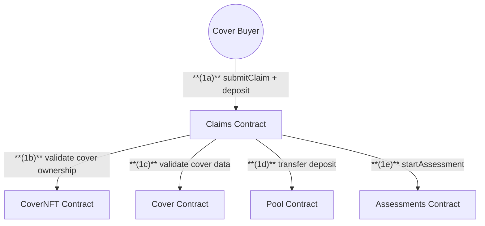
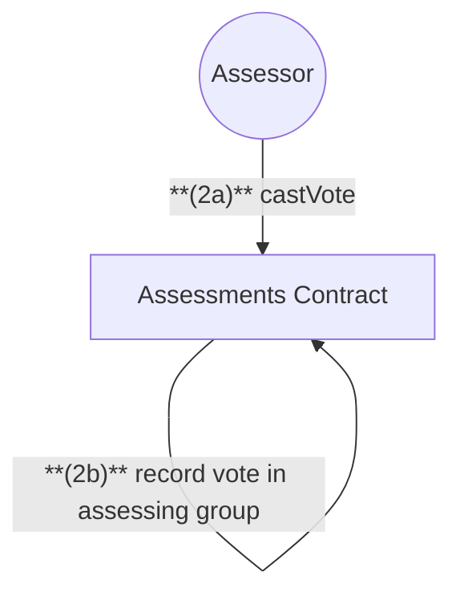
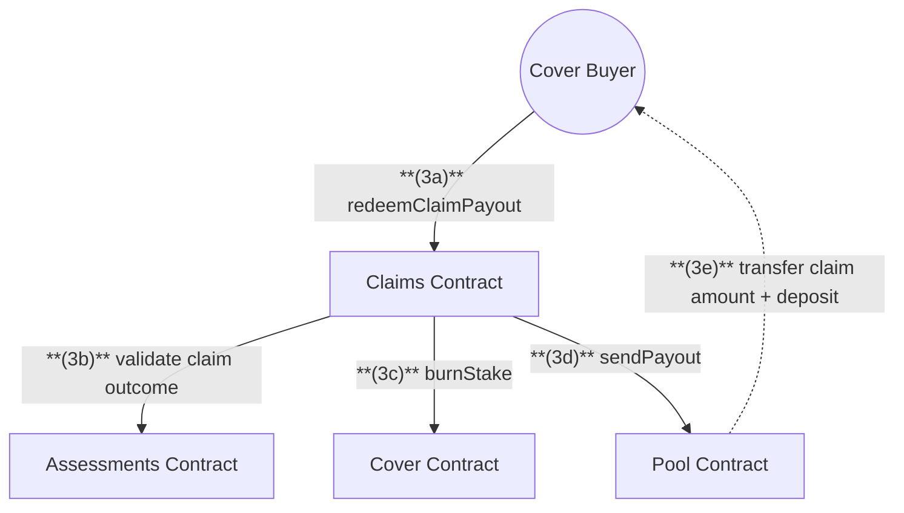
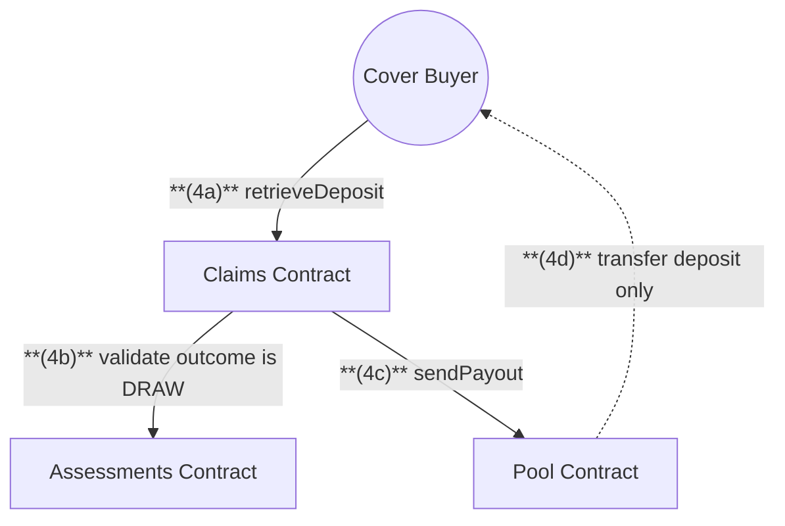

# Claims & Assessments

## 1. Submit Claim Flow

## 2. Assessment Voting Flow

- **Voting Period**: 3 days from claim submission
- **Cooldown Period**: starts after voting ends (typically 24 hours - product dependent)
- See [Technical Notes](#technical-notes) for complete timing details

## 3. Claim Payout Flow (Accepted)

- **Period Start**: Payout redemption period begins after the assessment cooldown period ends
- **Redemption Period**: Must be redeemed within the payout redemption period (typically 30 days - product dependent)
- See [Technical Notes](#technical-notes) for complete timing details

## 4. Deposit Retrieval Flow (Draw)

## Claim Submission & Processing

### 1. Submit Claim

**(1a)** `Cover Buyer` calls **submitClaim** on `Claims` contract with ETH deposit
**(1b)** `Claims` validates cover ownership via `CoverNFT`
**(1c)** `Claims` validates claim amount and cover validity via `Cover`
**(1d)** `Claims` transfers deposit to `Pool`
**(1e)** `Claims` starts assessment process via `Assessments` contract

### 2. Assessment Process

**(2a)** `Assessors` from the assigned assessing group call **castVote** on `Assessments`
**(2b)** `Assessments` records votes (accept/deny) for the claim

### 3. Claim Payout (Accepted Outcome)

**(3a)** `Cover Buyer` calls **redeemClaimPayout** on `Claims`
**(3b)** `Claims` validates with `Assessments`:

- Voting period has ended (3 days)
- Assessment outcome is ACCEPTED (accept votes > deny votes)
- Assessment cooldown period has passed (starts after voting ends, typically 24 hours)
- Must be within payout redemption period (starts after cooldown ends, typically 30 days)

**(3c)** `Claims` calls `Cover` to burn stake from affected staking pools
**(3d)** `Claims` requests payout from `Pool`
**(3e)** `Pool` transfers:

- Claim amount in cover asset
- Assessment deposit in ETH

### 4. Deposit Retrieval (Draw Outcome)

**(4a)** `Cover Buyer` calls **retrieveDeposit** on `Claims`
**(4b)** `Claims` validates with `Assessments` that outcome is DRAW (accept votes = deny votes)
**(4c)** `Claims` requests deposit from `Pool`
**(4d)** `Pool` transfers assessment deposit in ETH only

## Assessment Outcomes

- **ACCEPTED**: Accept votes > Deny votes → Claimant can redeem payout + deposit
- **DENIED**: Deny votes > Accept votes → Deposit remains in Pool
- **DRAW**: Accept votes = Deny votes → Claimant can retrieve deposit and resubmit claim

## Technical Notes

- Claims can be submitted **before the grace period ends** (cover expiry + grace period)
- Claimant deposits ETH when submitting (**0.05 ETH**)
- **Assessment voting period**: 3 days from claim submission
- **Cooldown period**: Starts immediately after voting period ends (typically 24 hours, product-type dependent)
- **Payout redemption period**: Starts after cooldown ends (typically 30 days, product-type dependent)
- Assessors are part of assessing groups assigned per product type
- Not all assessors are required to vote; outcome determined by votes cast at voting period end
- Approved claims burn staked NXM from the staking pools that backed the cover
