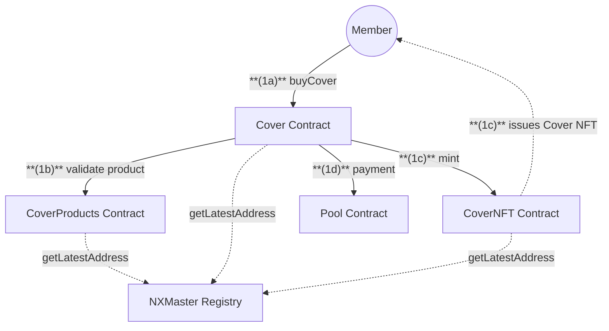
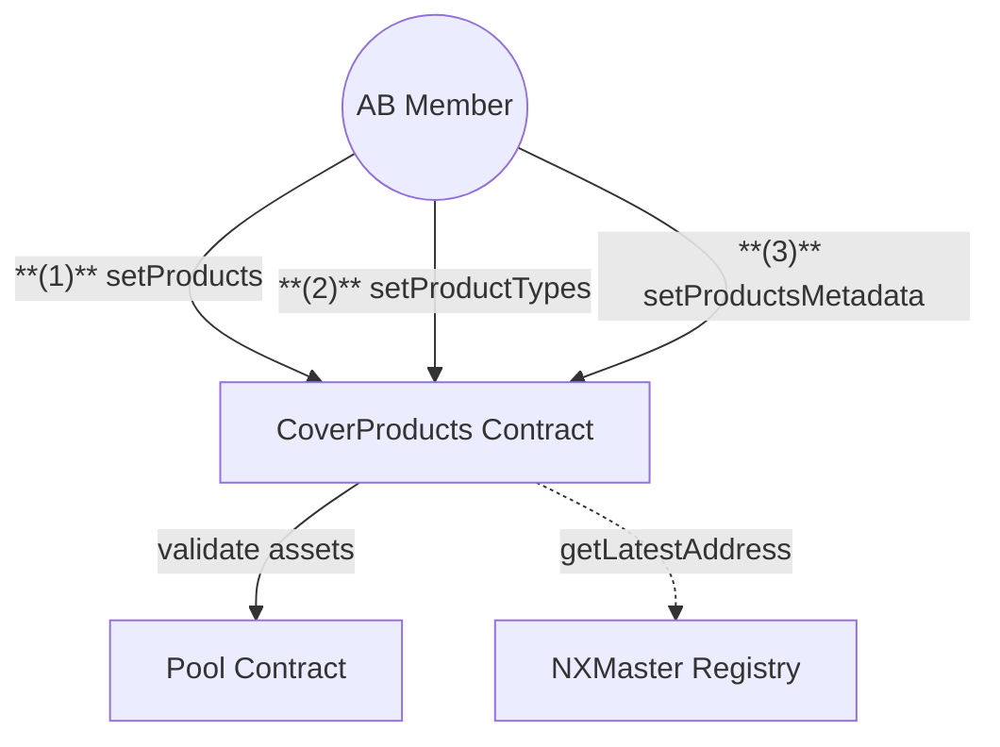

# Cover Contracts

## 1. Buy Cover Flow

## 2. Product Management Flow

## Actions

### Quick Summary:

1. Members receive a Cover NFT as proof when purchasing cover
2. AB Members manage products

### 1. Member Actions

1. **Buy Cover**
   **(1a)** `Member` calls `buyCover` on Cover with:
   - Product ID
   - Cover amount
   - Cover period
   - Payment asset
   - Cover asset
     **(1b)** `Cover` validates product with CoverProducts
     **(1c)** `Cover` mints NFT representing cover
     - issues Cover NFT to buyer
       **(1d)** `Cover` processes payment via Pool

### 2. Advisory Board Actions

1. **Product Configuration**
   **(1)** `AB Member` calls `setProducts` on CoverProducts to:

   - Add new products (`productId = uint256.max`)
   - Update existing products
   - Set initial price ratios
   - Set capacity reduction ratios
   - Configure allowed staking pools

   **(2)** `AB Member` calls `setProductTypes` on CoverProducts to:

   - Define product types (`productTypeId = uint256.max`)
   - Set grace periods
   - Set product type names
   - Update product type metadata

   **(3)** `AB Member` calls `setProductsMetadata` to:

   - Update product IPFS metadata
   - Update product type IPFS metadata

## Notes

- Cover NFTs represent ownership of cover policies
- Products must be configured before they can be purchased
- Cover periods have minimum (28 days) and maximum (365 days) durations
- Products can be deprecated which prevents new cover purchases
- Products can be restricted to specific staking pools
- All contracts fetch latest addresses from NXMaster Registry
- Product metadata is stored on IPFS with timestamps
- Initial price ratio must be above product minimum price

## Registry Dependencies

All contracts fetch latest contract addresses from NXMaster:

- CoverProducts: P1 (Pool), CO (Cover), MR (MemberRoles), SP (StakingProducts)
- Cover: P1 (Pool), TC (TokenController), MR (MemberRoles), CP (CoverProducts)
- CoverNFT: Operator address
