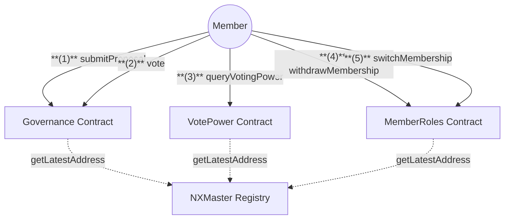
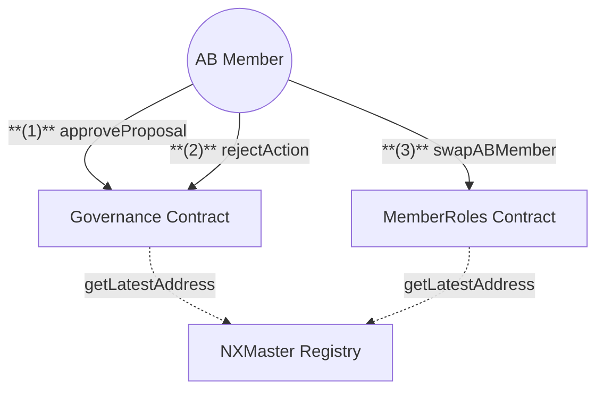

# Governance & Membership Contracts

## 1. Member Flow

## 2. Advisory Board Flow

## Actions

### Quick Summary:

1. Members can submit and vote on proposals
2. AB Members review and approve proposals
3. Operators execute approved proposals

### 1. Member Actions

1. **Submit Proposal**

   - **Member** calls `submitProposal` on Governance with:
     - Proposal title
     - Short description
     - Proposal description hash
     - Category ID

2. **Vote on Proposal**

   - **Member** calls `vote` on Governance with:
     - Proposal ID
     - Solution ID
     - Include managed staking pools flag

3. **Query Voting Power**

   - **Member** calls `queryVotingPower` on VotePower to:
     - Check voting influence
     - View delegated voting power

4. **Withdraw Membership**

   - **Member** calls `withdrawMembership` on MemberRoles to:
     - Remove membership status
     - Burn remaining NXM tokens

5. **Switch Membership**
   - **Member** calls `switchMembership` on MemberRoles to:
     - Transfer membership to new address
     - Move NXM tokens and assets

### 2. Advisory Board Actions

1. **Approve Proposal**

   - **AB Member** calls `approveProposal` on Governance to:
     - Move proposal to voting stage
     - Set voting parameters

2. **Reject Action**

   - **AB Member** calls `rejectAction` on Governance to:
     - Block suspicious proposal execution
     - Requires majority AB rejection

3. **Swap AB Member**
   - **AB Member** calls `swapABMember` on MemberRoles to:
     - Replace existing AB member
     - Update AB member registry

### 3. Operator Actions

1. **Execute Proposal**
   - **Operator** calls `triggerAction` on Governance to:
     - Execute approved proposals
     - Must wait for action waiting time
     - Handles proposal implementation

## Notes

- Proposals require minimum token holding time
- AB members can reject suspicious proposals
- Voting power includes delegated votes
- Members can delegate voting power
- Special resolutions have different majority requirements
- All contracts fetch latest addresses from NXMaster Registry

## NXMMaster Registry Dependencies

All contracts fetch latest contract addresses from NXMaster:

- **Governance:** TC (`TokenController`), MR (`MemberRoles`), PC (`ProposalCategory`)
- **MemberRoles:** TC (`TokenController`), P1 (`Pool`), CO (`Cover`), PS (`PooledStaking`), AS (`Assessment`)
- **VotePower:** TC (`TokenController`), MR (`MemberRoles`), GV (`Governance`)
