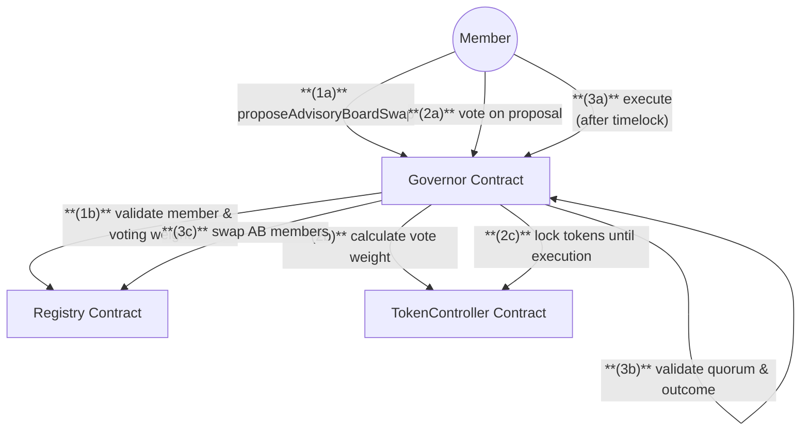
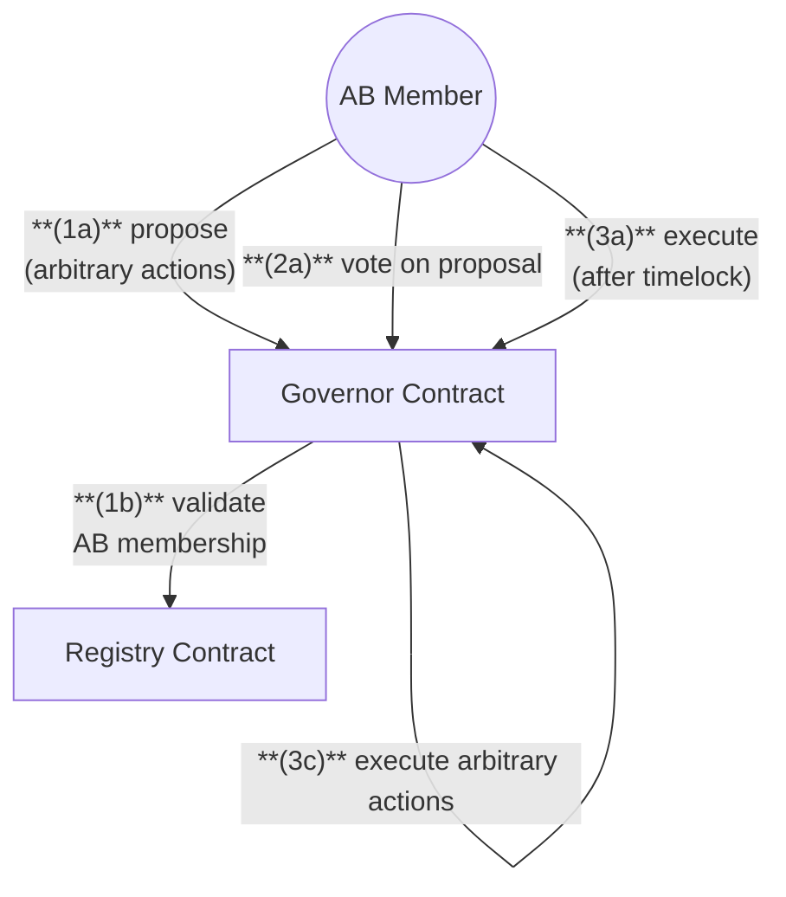

# Governor & Registry Contracts

## 1. Member Proposal Flow

- **Proposal Threshold**: Minimum 100 NXM tokens required to propose AB swaps
- **Vote Weight**: Based on total NXM balance, capped at 5% of total supply
- **Token Locking**: Member tokens locked during voting until proposal execution deadline
- See [Technical Notes](#technical-notes) for timing and quorum details

## 2. Advisory Board Proposal Flow

- **Proposal Content**: AB members can propose arbitrary system actions
- **Vote Weight**: Each AB member has equal vote weight of 1
- **Threshold**: Requires ≥3 supporting AB votes to pass
- See [Technical Notes](#technical-notes) for timing details

## Governance Flow Summary

### 1. Member Proposal Process

**(1a)** `Member` calls **proposeAdvisoryBoardSwap** on `Governor` with AB member swaps
**(1b)** `Governor` validates member status and voting weight (≥100 NXM) via `Registry`
**(1c)** `Governor` creates member proposal with 3-day voting period

**(2a)** `Members` call **vote** on `Governor` during voting period
**(2b)** `Governor` calculates vote weight via `TokenController` (NXM balance + 1, capped at 5%)
**(2c)** `Governor` locks member tokens via `TokenController` until execution deadline

**(3a)** `Member` calls **execute** on `Governor` after timelock period
**(3b)** `Governor` validates quorum (≥15% participation) and outcome (for > against)
**(3c)** `Governor` executes AB member swaps via `Registry`

### 2. Advisory Board Proposal Process

**(1a)** `AB Member` calls **propose** on `Governor` with arbitrary transactions
**(`1b`)** `Governor` validates AB membership via Registry
**(1c)** `Governor` creates AB proposal with 3-day voting period

**(2a)** `AB Members` call **vote** on `Governor` during voting period
**(2b)** `Governor` records AB votes with weight of 1 each

**(3a)** `AB Member` calls **execute** on `Governor` after timelock period
**(3b)** `Governor` validates threshold (≥3 supporting votes) and outcome
**(3c)** `Governor` executes arbitrary transactions

## Proposal Outcomes

- **PASSED**: For votes > Against votes AND meets threshold/quorum requirements
- **FAILED**: Against votes ≥ For votes OR doesn't meet threshold/quorum requirements

## Technical Notes

### Proposal Timeline
- **Voting Period**: 3 days from proposal creation
- **Timelock Period**: 1 day after voting ends before execution allowed
- **Early Closure**: AB proposals automatically close voting when ≥3 votes received

### Member Proposals
- **Proposal Threshold**: ≥100 NXM tokens required to create proposal
- **Vote Weight**: `totalBalanceOf(voter) + 1 NXM`, capped at 5% of total supply
- **Quorum**: ≥15% of total NXM supply must participate in voting
- **Token Locking**: Member tokens locked from vote time until execution deadline
- **Scope**: Limited to Advisory Board member swaps only

### Advisory Board Proposals
- **Proposal Content**: Can contain arbitrary system actions/transactions
- **Vote Weight**: Each AB member has equal weight of 1
- **Threshold**: ≥3 supporting votes required to pass
- **No Token Locking**: AB members don't lock tokens when voting

### Registry Dependencies

Governor contract fetches addresses from Registry for:
- **TokenController**: For vote weight calculation and token locking
- **Registry**: For member validation and AB member management