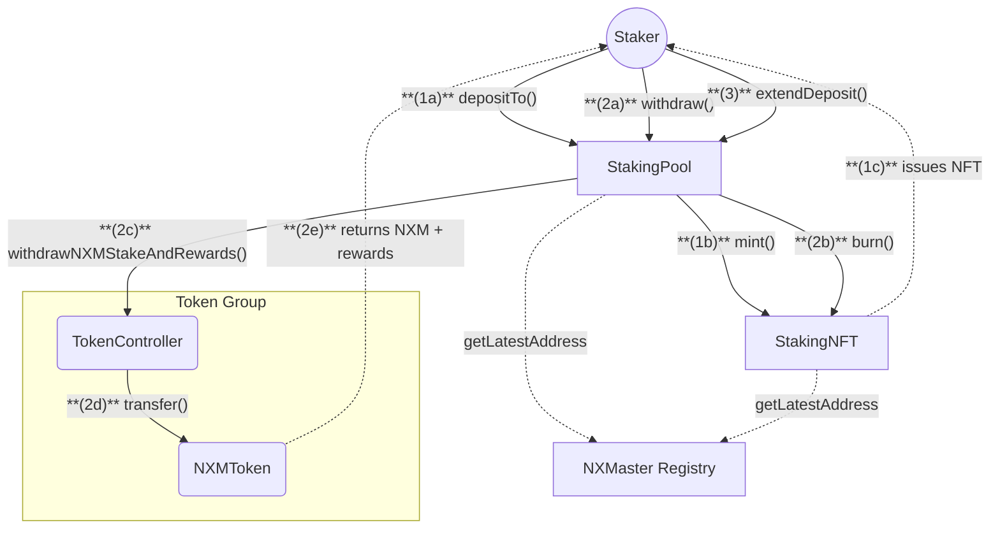
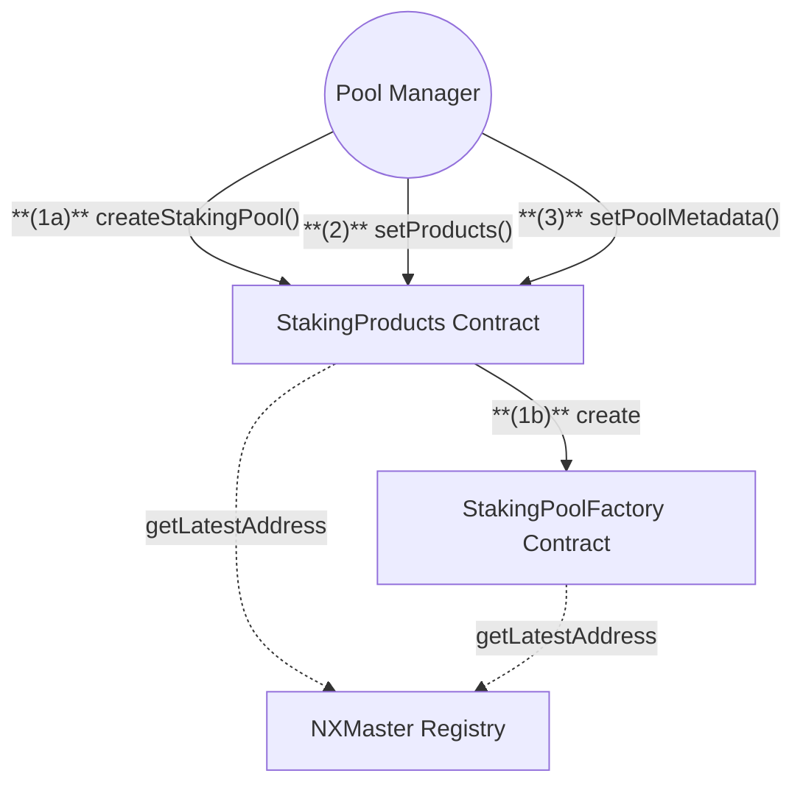

# Staking Contracts

## 1. Staker Flow

## 2. Staking Pool Manager Flow

## Actions

### Quick Summary:

1. Stakers can deposit NXM and receive Staking NFTs
2. Pool Managers configure products and pool parameters
3. Staking periods use 91-day tranches

### 1. Staker Actions

1. **Deposit Stake**
   **(1a)** `Staker` calls `depositTo()` on StakingPool with:

   - Amount of NXM to stake
   - Target tranche ID
   - Optional existing NFT ID
     **(1b)** `StakingPool` calls `mint()` on StakingNFT
     **(1c)** `StakingNFT` issues NFT to staker

2. **Withdraw Stake**
   **(2a)** `Staker` calls `withdraw()` on StakingPool with:

   - NFT ID
   - Tranche IDs
   - Amount to withdraw
     **(2b)** `StakingPool` calls `burn()` on StakingNFT
     **(2c)** `StakingPool` calls `withdrawNXMStakeAndRewards()` on TokenController
     **(2d)** `TokenController` calls `transfer()` on NXMToken
     **(2e)** `NXMToken` returns NXM + rewards to staker

3. **Extend Deposit**
   **(3)** `Staker` calls `extendDeposit()` on StakingPool with:
   - NFT ID
   - Source tranche ID
   - Target tranche ID
   - Amount to extend

### 2. Staking Pool Manager Actions

1. **Create Pool**
   **(1a)** `Manager` calls `createStakingPool()` on StakingProducts with:

   - Pool privacy setting
   - Initial and max pool fees
   - Product initialization parameters
   - IPFS metadata hash
     **(1b)** `StakingProducts` calls `create()` on StakingPoolFactory

2. **Configure Products**
   **(2)** `Manager` calls `setProducts()` on StakingProducts with:

   - Product IDs
   - Target weights
   - Target price

3. **Update Metadata**
   **(3)** `Manager` calls `setPoolMetadata()` on StakingProducts with:
   - Pool ID
   - New IPFS metadata hash

## Notes

- Staking periods are organized in 91-day tranches
- NFTs represent ownership of staked NXM and rewards
- Pools can be public or private
- Pool managers set product weights and pricing
- Rewards are distributed based on stake duration
- All contracts fetch latest addresses from NXMaster Registry

## Registry Dependencies

All contracts fetch latest contract addresses from NXMaster:

- StakingPool: TC (TokenController), P1 (Pool), SP (StakingProducts)
- StakingProducts: TC (TokenController), PF (StakingPoolFactory), CP (CoverProducts)
- StakingNFT: Operator address
