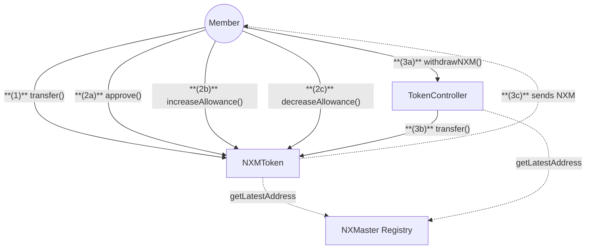
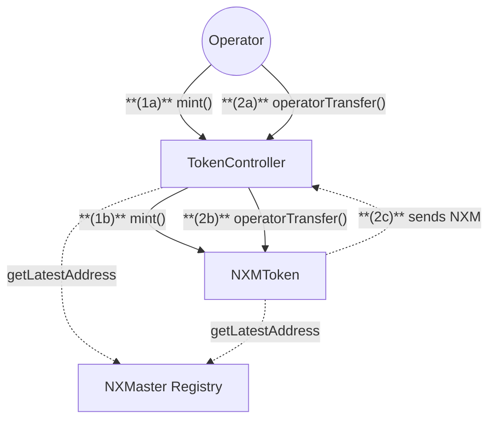

# Token Contracts

## 1. Member Flow

## 2. Operator Flow

## Actions

### Quick Summary:

1. Only members can hold, receive, or transfer NXM tokens
2. Members can manage token allowances for approved addresses
3. Operators can mint tokens and execute special transfers
4. Token transfers can be paused in emergencies

### 1. Member Actions

1. **Transfer Tokens**

   - **Member** calls `transfer()` on NXMToken with:
     - Recipient address
     - Amount to transfer

2. **Approve Spending**

   - **Member** calls `approve()` on NXMToken with:
     - Spender address
     - Amount to approve

3. **Check Balance**
   - **Member** calls `balanceOf()` on NXMToken to:
     - View current token balance

### 2. Operator Actions

1. **Mint Tokens**
   (1a) **Operator** calls `mint()` on TokenController with:

   - Recipient address
   - Amount to mint
     (1b) **TokenController** calls `mint()` on NXMToken

2. **Burn Tokens**
   (2a) **Operator** calls `burn()` on TokenController with:

   - Token holder address
   - Amount to burn
     (2b) **TokenController** calls `burn()` on NXMToken

3. **Pause Token**
   - **Operator** calls `pauseToken()` on TokenController to:
     - Halt token transfers in emergencies

## Notes

- Token transfers can be paused in emergencies
- Minting has configurable limits
- All contracts fetch latest addresses from NXMaster Registry

## NXMMaster Registry Dependencies

All contracts fetch latest contract addresses from NXMaster:

- **TokenController:** MR (`MemberRoles`), NXM (`NXMToken`)
- **NXMToken:** TC (`TokenController`)
