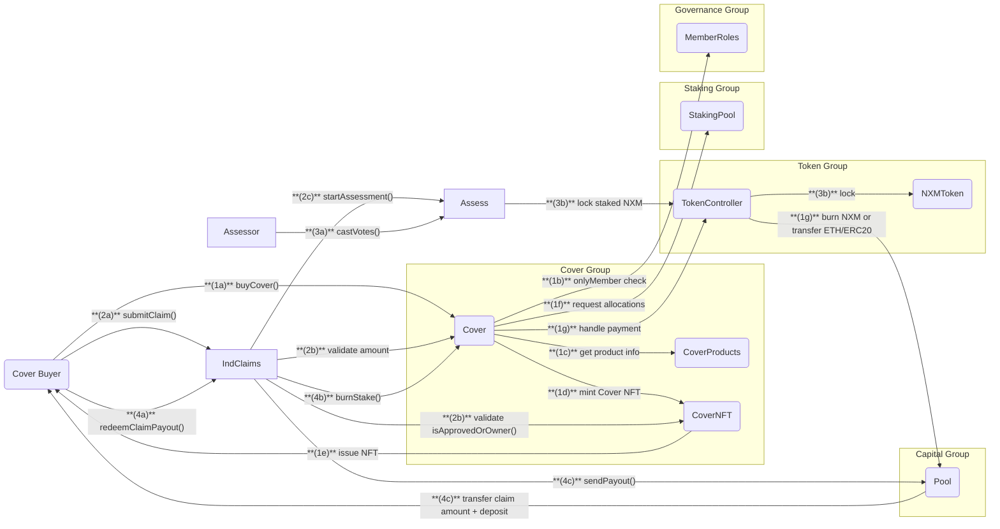
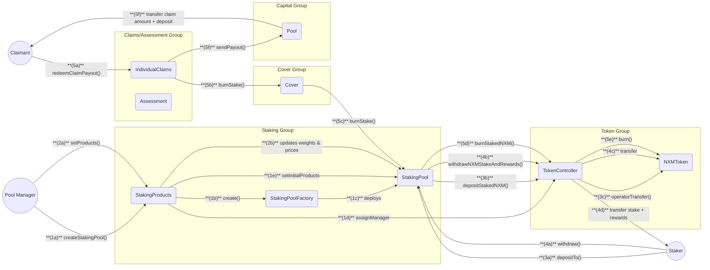

## Nexus Mutual Platform Flow Diagram

This document merges multiple **Cover** and **Staking** flows with their underlying interactions across **Token**, **Capital**, **Claims/Assessment**, and **Governance** groupings. We use two comprehensive flows:

1. Buying Cover and Processing Claims
   - Includes:
     - Buying Cover (**Cover ↔ Token ↔ Capital**)
     - Submitting and Assessing Claims (**Claims/Assessment ↔ Cover ↔ Capital ↔ Governance**)
2. Staking Pool Management and Staking Lifecycle
   - Includes:
     - Pool creation and product listing (**Staking ↔ Token**)
     - Stakers redeeming rewards (**Staking ↔ Token**)
     - Burning NXM on approved claims (**Claims/Assessment ↔ Staking ↔ Token**)

We provide detailed steps and a **Mermaid diagram** for each flow, ensuring step numbering in both the **text description** and **diagrams** for clarity. Code blocks are **escaped** so they remain valid raw markdown.

---

## Buying Cover & Processing Claims

### Step-by-Step

1. **Buyer Purchases Cover**  
   **(1a)** `Buyer` calls `buyCover(params, poolAllocationRequests)` on **Cover**.  
   **(1b)** `Cover` checks if buyer is a member via `onlyMember` modifier.  
   **(1c)** `Cover` gets product info from **CoverProducts**.  
   **(1d)** `Cover` mints NFT via **CoverNFT** if new cover.  
   **(1e)** `CoverNFT` issues NFT to buyer.  
   **(1f)** `Cover` requests allocations from **StakingPool**(s).  
   **(1g)** `Cover` handles payment: - For NXM: Burns premium via **TokenController** - For ETH/ERC20: Transfers premium to **Pool**

2. **Buyer Submits Claim**  
   **(2a)** `Buyer` calls `submitClaim()` on **IndividualClaims**.  
   **(2b)** `IndividualClaims` validates:

   - Cover ownership via `CoverNFT.isApprovedOrOwner()`
   - Cover validity via `Cover.coverSegmentWithRemainingAmount()`

   **(2c)** `IndividualClaims` starts assessment via `Assessment.startAssessment()`.

3. **Claim Assessment**  
   **(3a)** `Assessors` call `castVotes()` on **Assessment**.  
   **(3b)** `Assessment` locks staked NXM via **TokenController**.  
   **(3c)** When voting ends:

   - If accepted: Claim can be redeemed
   - If denied: Claim deposit funds rewards

4. **Claim Payout**  
   **(4a)** `Buyer` calls `redeemClaimPayout()` on **IndividualClaims**.  
   **(4b)** `IndividualClaims` calls `Cover.burnStake()` to burn staker's NXM.  
   **(4c)** `IndividualClaims` calls `Pool.sendPayout()` which: - Transfers claim amount in cover asset - Returns assessment deposit in ETH

---

## Staking Pool Management & Staking Lifecycle

### Step-by-Step

1. **Pool Manager Creates a New Staking Pool**
   **(1a)** `Manager` calls `"createStakingPool()"` on **StakingProducts**.  
   **(1b)** `StakingProducts` calls `"create()"` on **StakingPoolFactory**.  
   **(1c)** `StakingPoolFactory` deploys new **StakingPool**.  
   **(1d)** `StakingProducts` assigns manager via **TokenController**.  
   **(1e)** `StakingProducts` sets initial products and metadata.
2. **Manager Updates Pool Products**
   **(2a)** `Manager` calls `"setProducts()"` on **StakingProducts**.  
   **(2b)** `StakingProducts` updates weights and prices in **StakingPool**.
3. **Staker Deposits NXM**
   **(3a)** `Staker` calls `"depositTo(amount, trancheId, tokenId, dest)"` on **StakingPool**.  
   **(3b)** `StakingPool` validates and calculates shares, calls `"depositStakedNXM()"` on **TokenController**.  
   **(3c)** `TokenController` updates pool balance and calls `"operatorTransfer()"` on **NXMToken**.
4. **Staker Withdraws Stake/Rewards**
   **(4a)** `Staker` calls `"withdraw()"` on **StakingPool**.

   - _Optional_: Check withdrawable amounts first via **NexusViewer** (`"getClaimableNXM()"`, `"getStakedNXM()"`)

   **(4b)** `StakingPool` calculates amounts, calls `"withdrawNXMStakeAndRewards()"` on **TokenController**.  
   **(4c)** `TokenController` calls transfers on **NXMToken**.
   **(4d)** `NXMToken` transfer stake + rewards to **Staker**
5. **Claim Redemption Burns Stake and Pays Claimant**
   If a claim is approved the claimant is paid from the staked NXM.
   **(5a)** `Claimant` calls `"redeemClaimPayout()"` on **IndividualClaims**.  
   **(5b)** `IndividualClaims` calls `"burnStake()"` on **Cover**.  
   **(5c)** `Cover` calls `"burnStake()"` on affected **StakingPool**(s).  
   **(5d)** `StakingPool` calls `"burnStakedNXM()"` on **TokenController**.  
   **(5e)** `TokenController` burns tokens via **NXMToken**.  
   **(5f)** `IndividualClaims` calls `"Pool.sendPayout()"` which:
   - Transfers claim amount in cover asset
   - Returns assessment deposit in ETH
