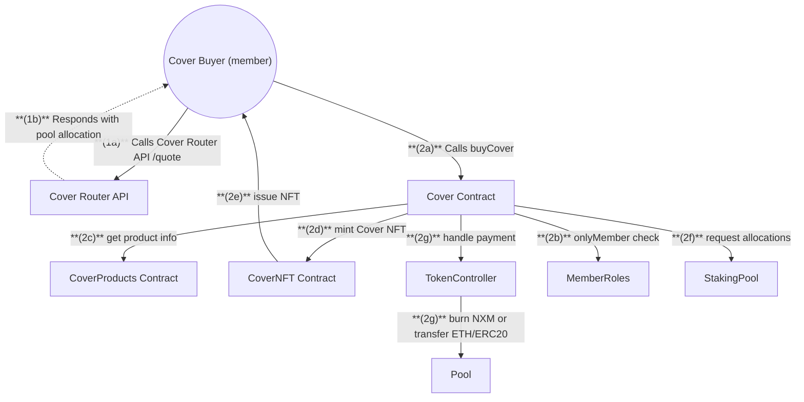
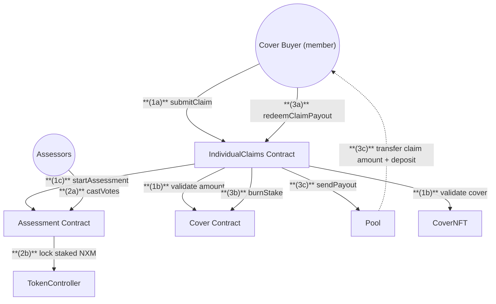

# Cover Buyer / Claims Flow

## Buy Cover Flow

## Claims Flow

## Cover Buyer Actions

1. **Buy Cover**

   - Get quote from Cover Router API `/quote` for pricing and pool allocations
   - Call `buyCover` on Cover contract with the pool allocation result

2. **Submit and Process Claim**
   - Call `submitClaim` on IndividualClaims to request a payout
   - Wait for assessment period where Assessors vote on the claim
   - If approved, call `redeemClaimPayout` on IndividualClaims to receive payout

---

## Getting a Cover Quote and Purchase

1. **Quote Process**
   **(1a)** `Cover Buyer` calls Cover Router API `/quote` to fetch price and pool allocation
   **(1b)** `Cover`outer API** responds with recommended pool allocation

2. **Cover Purchase**
   **(2a)** `Cover Buyer` calls `buyCover` on Cover with pool allocation
   **(2b)** `Cover` checks if buyer is a member
   **(2c)** `Cover` gets product info from CoverProducts
   **(2d)** `Cover` mints NFT via CoverNFT if new cover
   **(2e)** `CoverNFT` issues NFT to buyer
   **(2f)** `Cover` requests allocations from StakingPool(s)
   **(2g)** `Cover` handles payment:
   - For NXM: Burns premium via TokenController
   - For ETH/ERC20: Transfers premium to Pool

---

## Claim Submission & Processing

1. **Submit Claim**
   **(1a)** `Cover Buyer` calls `submitClaim` on IndividualClaims
   **(1b)** `IndividualClaims` validates:

   - Cover ownership via CoverNFT
   - Cover validity via Cover
     **(1c)** `IndividualClaims` starts assessment process

2. **Assessment Process**
   **(2a)** `Assessors` call `castVotes` on Assessment
   **(2b)** `Assessment` locks staked NXM for voting period

3. **Claim Payout**
   **(3a)** `Cover Buyer` calls `redeemClaimPayout` on IndividualClaims
   **(3b)** `IndividualClaims` calls Cover to burn stake from affected pools
   **(3c)** `IndividualClaims` sends payout via Pool which:
   - Transfers claim amount in cover asset
   - Returns claim deposit in ETH
