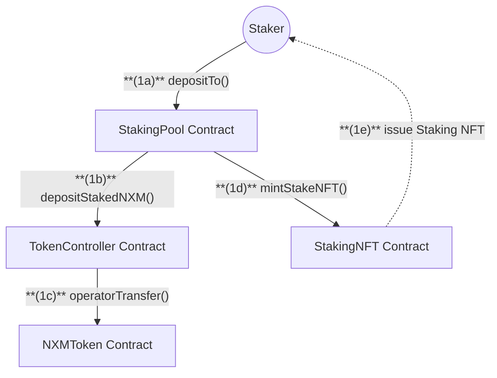
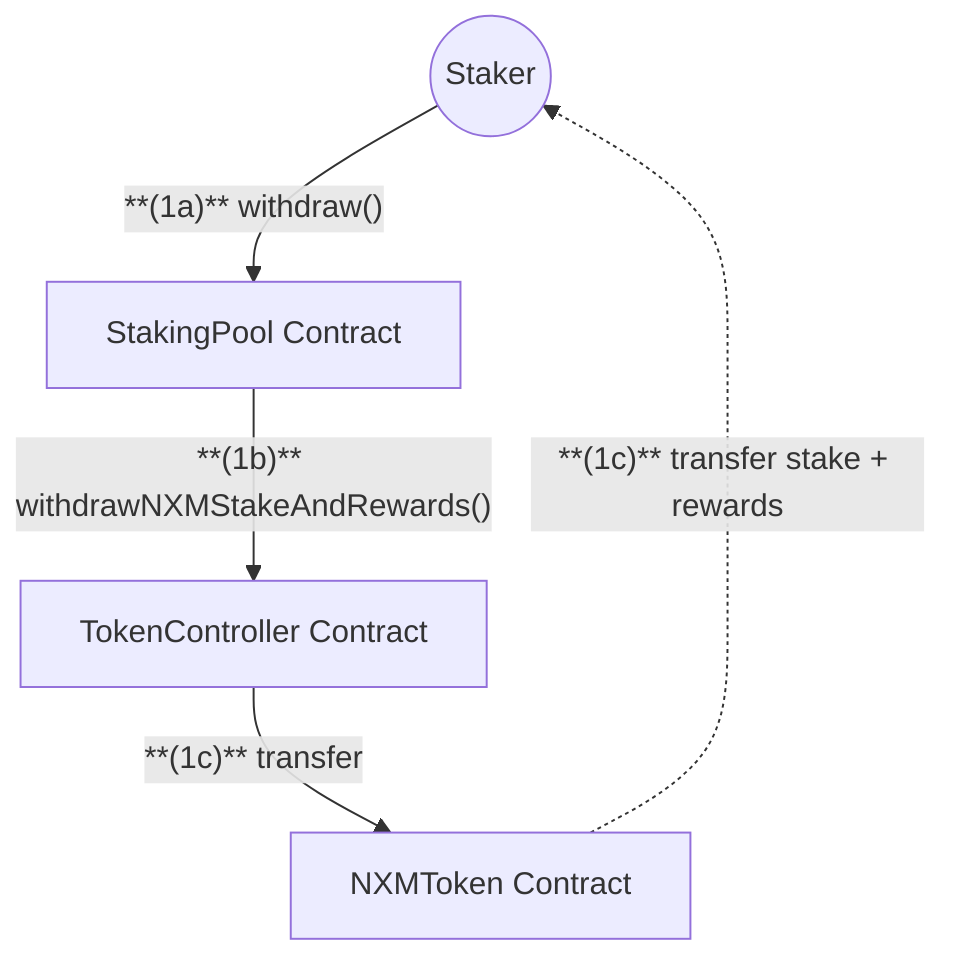

# Staker Flow

## Deposit Stake Flow

## Withdraw Flow

## Staker Actions

1. **Deposit Stake**

   - Call `depositTo` on StakingPool to stake NXM
   - Specify:
     - Amount of NXM to stake
     - Tranche ID for allocation
     - Optional NFT token ID for existing position
   - Receive Staking NFT as proof of stake

2. **Withdraw Stake and Rewards**
   - Call `withdraw` on StakingPool to:
     - Withdraw stake and/or rewards
     - Specify tranche IDs to withdraw from
     - Provide Staking NFT token ID
   - Optional: Check withdrawable amounts first via NexusViewer

---

## Deposit Stake Flow

**(1a)** `Staker` calls `depositTo()` on **StakingPool**.
**(1b)** `StakingPool` validates and calculates shares, calls `depositStakedNXM()` on **TokenController**.
**(1c)** `TokenController` updates pool balance and transfers NXM via **NXMToken**.
**(1d)** `StakingPool` calls `mintStakeNFT()` on **StakingNFT**.
**(1e)** `StakingNFT` issues NFT to staker as proof of stake.

---

## Withdraw Stake Flow

**(1a)** `Staker` calls `withdraw()` on **StakingPool**.
**(1b)** `StakingPool` calculates amounts, calls `withdrawNXMStakeAndRewards()` on **TokenController**.
**(1c)** `TokenController` transfers stake and rewards to staker via **NXMToken**.
