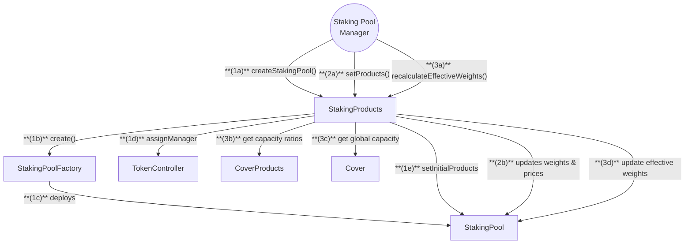

# Staking Pool Manager Flow

## Staking Pool Manager Actions

1. **Create Staking Pool**

   - Call `createStakingPool` on StakingProducts to deploy a new pool
   - Pool is initialized with:
     - Initial products and weights
     - Pool fee parameters
     - Manager assignment
     - Pool metadata

2. **Update Pool Products**

   - Call `setProducts` on StakingProducts to:
     - Configure product weights
     - Set target prices
     - Update pool metadata

3. **Maintain Pool Allocations**
   - Call `recalculateEffectiveWeights` on StakingProducts to:
     - Rebalance product allocations based on capacity
     - Adjust for global and product-specific constraints
     - Update after significant stake or price changes

---

## Staking Pool Creation Flow

**(1a)** `Pool Manager` calls `createStakingPool()` on **StakingProducts**.
**(1b)** `StakingProducts` calls `create()` on **StakingPoolFactory**.
**(1c)** `StakingPoolFactory` deploys new **StakingPool**.
**(1d)** `StakingProducts` assigns manager via **TokenController**.
**(1e)** `StakingProducts` sets initial products and metadata.

---

## Update Staking Pool Products

**(2a)** `Pool Manager` calls `setProducts()` on **StakingProducts**.
**(2b)** `StakingProducts` updates weights and prices in **StakingPool**.

---

## Recalculate Effective Weights

**(3a)** `Pool Manager` calls `recalculateEffectiveWeights()` on **StakingProducts**.
**(3b)** `StakingProducts` gets capacity reduction ratios from **CoverProducts**.
**(3c)** `StakingProducts` gets global capacity ratio from **Cover**.
**(3d)** `StakingProducts` updates effective weights based on:

- Active stake in pool
- Global capacity constraints
- Product-specific capacity reductions
- Current allocations vs capacity
