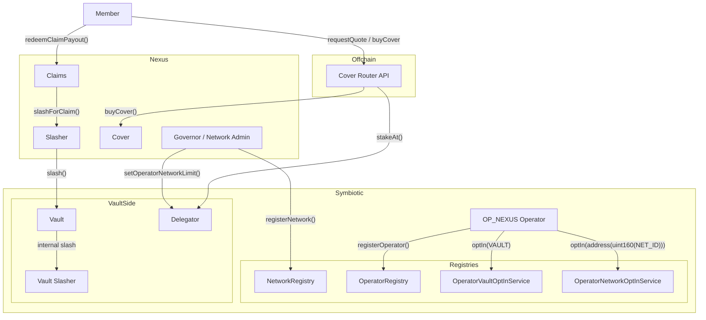

```mermaid
graph TD

  subgraph Nexus
    GOV[Governor / Network Admin]
    COV[Cover]
    CLAIMS[Claims]
    SLASHER[Slasher]
  end

  subgraph Offchain
    CR[Cover Router API]
  end

  subgraph Symbiotic
    subgraph Registries
      NR[NetworkRegistry]
      OR[OperatorRegistry]
      OVO[OperatorVaultOptInService]
      ONO[OperatorNetworkOptInService]
    end

    subgraph VaultSide
      VAULT[Vault]
      DELEGATOR[Delegator]
      VSL[Vault Slasher]
    end

    OP[OP_NEXUS Operator]
  end

  MEM[Member]

  %% --- User / Nexus / Offchain paths ---
  MEM -- requestQuote / buyCover --> CR
  CR -- buyCover() --> COV

  MEM -- redeemClaimPayout() --> CLAIMS
  CLAIMS -- slashForClaim() --> SLASHER

  %% --- Nexus -> Symbiotic calls ---
  CR -- stakeAt() --> DELEGATOR
  SLASHER -- slash() --> VAULT
  VAULT -- internal slash --> VSL

  %% --- Setup / integration calls ---
  GOV -- registerNetwork() --> NR
  OP -- registerOperator() --> OR
  OP -- optIn(VAULT) --> OVO
  OP -- optIn(address(uint160(NET_ID))) --> ONO
  GOV -- setOperatorNetworkLimit() --> DELEGATOR
```