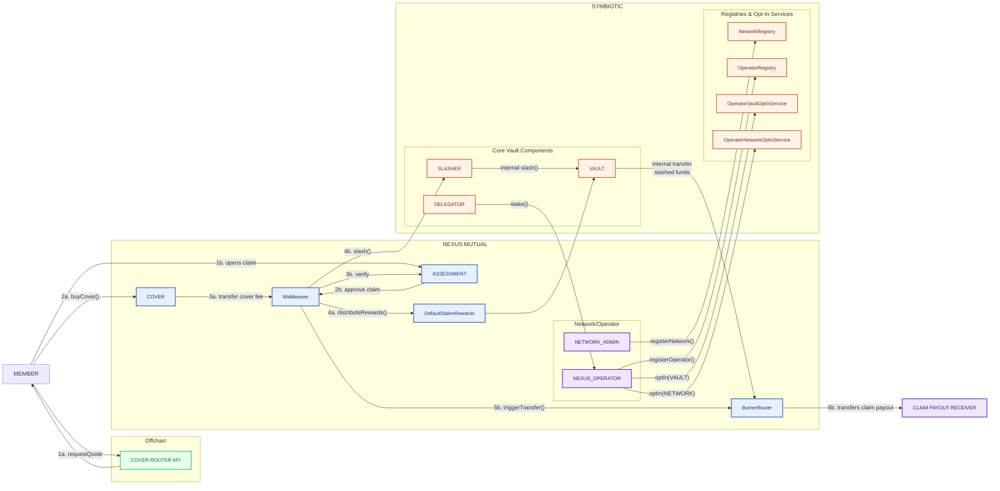

```mermaid
graph LR
  %% Configuration for custom styling (Minimal coloring for readability)
  %% Increased font-size and darker text color for better readability
  classDef nexus fill:#E6F0FF,stroke:#3366CC,stroke-width:2px,color:#1a3366,font-size:14px;
  classDef symbiotic fill:#FFF2E6,stroke:#CC6633,stroke-width:2px,color:#66331a,font-size:14px;
  classDef offchain fill:#E6FFEC,stroke:#33CC66,stroke-width:2px,color:#1a6633,font-size:14px;
  classDef actor fill:#F0E6FF,stroke:#6633CC,stroke-width:2px,color:#331a66,font-size:14px;

  %% --- 0. External Entities ---
  MEM[MEMBER]:::ACTOR
  CPR[CLAIM PAYOUT RECEIVER]:::actor

  %% --- 1. Offchain Router ---
  subgraph Offchain
    CR[COVER-ROUTER API]
    class CR offchain
  end

  %% --- 2. Nexus Subgraph ---
  subgraph NEXUS MUTUAL
    COV[COVER]
    ASSESSMENT[ASSESSMENT]
    MIDDLEWARE[Middleware]
    BURNER[BurnerRouter]
    REWARDS[DefaultStakerRewards]

    subgraph "Network/Operator"
        SAFE[NETWORK_ADMIN]
        OP[NEXUS_OPERATOR]
        class SAFE,OP actor
    end

    class COV,ASSESSMENT,MIDDLEWARE,BURNER,REWARDS nexus
  end

  %% --- 3. Symbiotic Subgraph ---
  subgraph SYMBIOTIC
    subgraph Core Vault Components
      VAULT[VAULT]
      DELEGATOR[DELEGATOR]
      VSL[SLASHER]
      class VAULT,DELEGATOR,VSL symbiotic
    end

    subgraph Registries & Opt-In Services
      NR[NetworkRegistry]
      OR[OperatorRegistry]
      OVO[OperatorVaultOptInService]
      ONO[OperatorNetworkOptInService]
      class NR,OR,OVO,ONO symbiotic
    end
  end

  %% --- Flow Definitions ---

  %% A. Cover Purchase & Reward Distribution Flow
  MEM -- 1a. requestQuote --> CR
  CR --> MEM
  MEM -- 2a. buyCover() --> COV
  COV -- 3a. transfer cover fee --> MIDDLEWARE
  MIDDLEWARE -- 4a. distributeRewards() --> REWARDS
  REWARDS --> VAULT

  %% B. Claims, Slashing, & Payout Flow
  MEM -- 1b. opens claim --> ASSESSMENT
  ASSESSMENT -- 2b. approve claim --> MIDDLEWARE
  MIDDLEWARE -- 3b. verify --> ASSESSMENT
  MIDDLEWARE -- 4b. slash() --> VSL
  VSL -- internal slash() --> VAULT
  VAULT -- internal transfer
  slashed funds --> BURNER
  MIDDLEWARE -- 5b. triggerTransfer() --> BURNER
  BURNER -- 6b. transfers claim payout --> CPR

  %% C. Setup & Configuration Flow
  SAFE -- registerNetwork() --> NR
  OP -- registerOperator() --> OR
  OP -- optIn(VAULT) --> OVO
  OP -- optIn(NETWORK) --> ONO
  DELEGATOR -- stake() --> OP
```