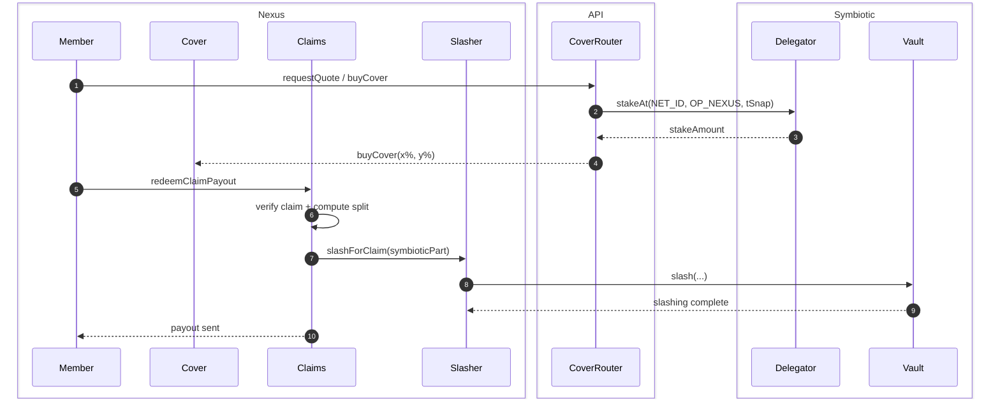

```mermaid
sequenceDiagram
    autonumber

    box Nexus
        participant MEM as Member
        participant COV as Cover
        participant CLAIMS as Claims
        participant SLASHER as Slasher
    end

    box API
        participant CR as CoverRouter
    end

    box Symbiotic
        participant DELEGATOR as Delegator
        participant VAULT as Vault
    end

    %% Cover flow
    MEM->>CR: requestQuote / buyCover
    CR->>DELEGATOR: stakeAt(NET_ID, OP_NEXUS, tSnap)
    DELEGATOR-->>CR: stakeAmount
    CR-->>COV: buyCover(x%, y%)

    %% Claim flow
    MEM->>CLAIMS: redeemClaimPayout
    CLAIMS->>CLAIMS: verify claim + compute split
    CLAIMS->>SLASHER: slashForClaim(symbioticPart)
    SLASHER->>VAULT: slash(...)
    VAULT-->>SLASHER: slashing complete
    CLAIMS-->>MEM: payout sent

```